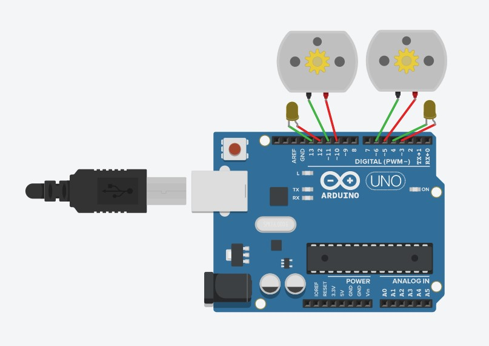
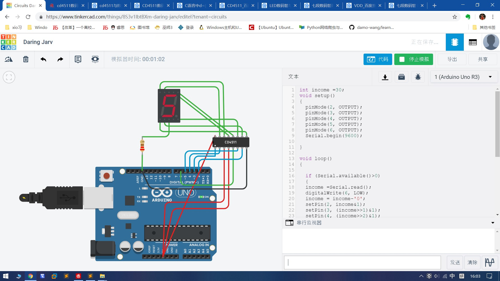
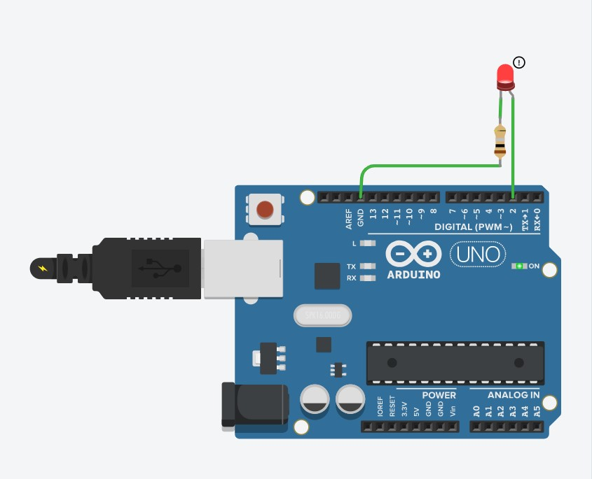

国际双创实践周 - 开源硬件实战

## 一. 国际双创实践周参与情况

### 第一天

- 简单介绍了ubuntu系统的使用以及shell的原理
- 展示了大会上使用arduino制作的作品图片

#### 作业:

- 安装 arduino processing fritzing 三个软件

- 注册GitHub 建立仓库用于提交编程作业

### 第二天

- 通过摩尔斯电码实例讲解了Arduino 基础编程
- 讲解了一些编程方法

作业:

- 通过类的方法完成, 从电脑串口接收一串字符, 使用LED 发送对应的Morse码


### 第三天

- 介绍了Arduino仿真网站 Tinkercad

- 讲解了电机的使用以及小车实例

- 讲解了7段数码管编程以及CD4511使用

作业:

- 给小车实例增加转向灯

- 通过串口输入数字, 在数码管显示对应数字

  

```c++
// 小车及转向灯实例
void setup()
{
  pinMode(5,OUTPUT);
  pinMode(6,OUTPUT);
  pinMode(9,OUTPUT);
  pinMode(10,OUTPUT);
  pinMode(2,OUTPUT);
  pinMode(3,OUTPUT);
  pinMode(12,OUTPUT);
  pinMode(13,OUTPUT);
  Serial.begin(9600);
}


int income=0;
void loop()
{
  if(Serial.available()>0)
  {
    income=Serial.read();
    switch(income)
    {
      case 'f':
        forward();
        break;
      case 'b':
        backward();
        break;
      case 'r':
        right();
        break;
      case 'l':
        left();
        break;
      case 's':
        stop();
        break;
      default:
        break;
    }
  }
}
  
void forward()
{
  digitalWrite(5,HIGH);
  digitalWrite(6,LOW);
  digitalWrite(10,HIGH);
  digitalWrite(9,LOW);
  digitalWrite(9,HIGH);
  digitalWrite(2,HIGH);
  digitalWrite(3,LOW);
  digitalWrite(13,HIGH);
  digitalWrite(12,LOW);
}
  
void backward()
{
  digitalWrite(6,HIGH);
  digitalWrite(5,LOW);
  digitalWrite(9,HIGH);
  digitalWrite(10,LOW);
  digitalWrite(3,HIGH);
  digitalWrite(2,LOW);
  digitalWrite(12,HIGH);
  digitalWrite(13,LOW);
}
  
void left()
{
  digitalWrite(5,HIGH);
  digitalWrite(6,LOW);
  digitalWrite(9,HIGH);
  digitalWrite(10,LOW);
  digitalWrite(12,HIGH);
  digitalWrite(13,LOW);
  digitalWrite(2,HIGH);
  digitalWrite(3,LOW);
}
  
void right()
{
  digitalWrite(6,HIGH);
  digitalWrite(5,LOW);
  digitalWrite(10,HIGH);
  digitalWrite(9,LOW);
  digitalWrite(3,HIGH);
  digitalWrite(2,LOW);
  digitalWrite(13,HIGH);
  digitalWrite(12,LOW);
}
  
void stop()
{
  digitalWrite(6,HIGH);
  digitalWrite(5,HIGH);
  digitalWrite(10,HIGH);
  digitalWrite(9,HIGH);
  digitalWrite(2,HIGH);
  digitalWrite(3,LOW);
  digitalWrite(13,HIGH);
  digitalWrite(12,LOW);
}

```



```c++
// 七段数码管
int income =30;
void setup()
{
  pinMode(2, OUTPUT);
  pinMode(3, OUTPUT);
  pinMode(4, OUTPUT);
  pinMode(5, OUTPUT);
  pinMode(6, OUTPUT);
  Serial.begin(9600);
  
}

void loop()
{
  
  if (Serial.available()>0)
  {
  income =Serial.read();
  digitalWrite(6, LOW);
  income = income-'0';
  setPin(2, income&1);
  setPin(3, (income>>1)&1);
  setPin(4, (income>>2)&1);
  setPin(5, (income>>3)&1);
  delay(10);
  digitalWrite(6, HIGH);
  delay(10);
  }
}

void setPin(int pin,int v)
{
  if(v>0)
  {
    digitalWrite(pin, HIGH);
  }
  else
  {
    digitalWrite(pin, LOW);
  }
}
  
```


### 第四天

- 以函数形式完善第一天内容

- 答疑

- 交流和总结

作业:

- 撰写总结报告以及README文档

  

```c++
// 函数形式的morse代码
int incomingByte = 0;
int length;

void setup()
{
    pinMode(13, OUTPUT);
  Serial.begin(9600);
    Serial.print("The Morse of sentence: ");
}
 
void loop()
{
  int i;
  int len=0;
  if (Serial.available() > 0)
  {
    incomingByte = Serial.read();
    Serial.print(char(incomingByte));
    ascii(incomingByte);
  }
}

void ascii(int x)
{
        
  switch(x)
  {
    case 'a': dot(); dash();  break;
    case 'b': dash(); dot(); dot(); dot();  break;
    case 'c': dash(); dot(); dash(); dot();  break;
    case 'd': dash(); dot(); dot();  break;
    case 'e': dot();  break;
    case 'f': dot(); dot(); dash(); dot();  break;
    case 'g': dash(); dash(); dot();  break;
    case 'h': dot(); dot(); dot(); dot();  break;
    case 'i': dot(); dot();  break;
    case 'j': dot(); dash(); dash(); dash();  break;
    case 'k': dash(); dot(); dash();  break;
    case 'l': dot(); dash(); dot(); dot();  break;
    case 'm': dash(); dash();  break;
    case 'n': dash(); dot();  break;
    case 'o': dash(); dash(); dash();  break;
    case 'p': dot(); dash(); dash(); dot();  break;
    case 'q': dash(); dash(); dot(); dash();  break;
    case 'r': dot(); dash(); dot();  break;
    case 's': dot(); dot(); dot();  break;
    case 't': dash();  break;
    case 'u': dot(); dot(); dash();  break;
    case 'v': dot(); dot(); dot(); dash();  break;
    case 'w': dot(); dash(); dash();  break;
    case 'x': dash(); dot(); dot(); dash();  break;
    case 'y': dash(); dot(); dash(); dash(); dash();  break;
    case 'z': dash(); dash(); dot(); dot();  break;
    case ' ':w_space();  break;
    default:  break;
  }
}

void dot()
{
  digitalWrite(2, HIGH);
  delay(250);
  digitalWrite(2, LOW);
  delay(250);
}

void dash()
{
  digitalWrite(2, HIGH);
  delay(1000);
  digitalWrite(2, LOW);
  delay(250);
}

void c_space()
{
  digitalWrite(2, LOW);
  delay(250*3);
}

void w_space()
{
  digitalWrite(2, LOW);
  delay(250*7);
}

```


## 二. 国际双创实验周主要收获

- 通过网站模拟的形式，切实地体会了如何通过硬件进行一些有意思地开发
- 学习了一些关于ubuntu arduino 编程思想的知识
- 实际操作使用的github，并且了解了一些本地上传文件的方法等等

## 三. 意见与建议

- 学生的知识水平层次不同，对于有些大二大三的同学，具备了一些电路知识和编程思想，但对于大一同学便不是特别友好
- 这就导致老师上课进度十分受影响，为了让大家都能跟上进度，只能讲一些较为基础的知识而不能深入
- 上课课时还是过少，对于实践类课程，连续上两周的课可能才会学到一些东西，而仅仅16个课时，远远深入不到内部
- 对于arduino 的问题，开源硬件实战因为没有arduino 板子而选择网上模拟的形式，虽然效果相似，但是体验相差巨大
- 希望学校能够提前进行安排，让学生自行购买板子也好，学校提前统一采购也好，都能对教学效果有一定保障
